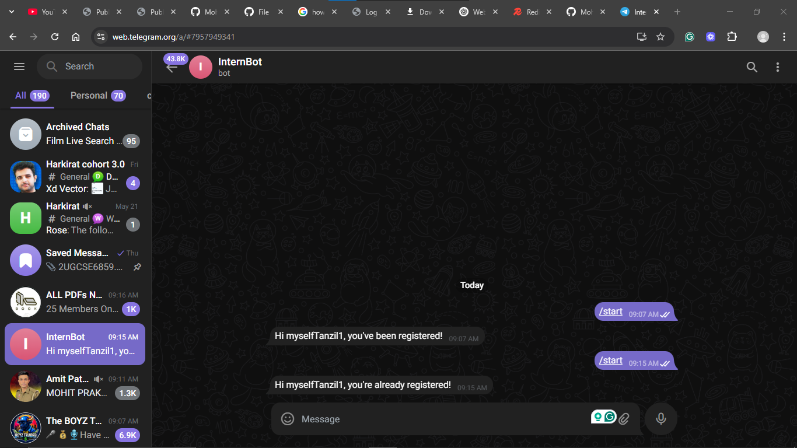
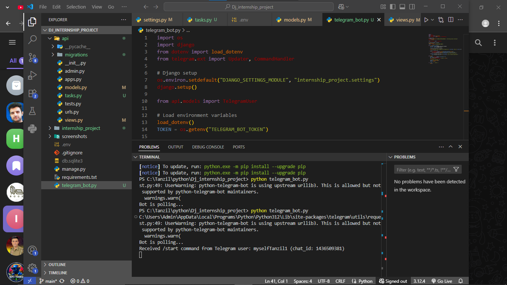

# Django Internship Assignment 🚀

This is my internship assignment project built with Django & Django REST Framework.

## 🔧 Features

-  Public API Endpoint (Accessible without authentication)
-  Protected API Endpoint (Token-based authentication)
-  Token Generation using DRF's authtoken
-  Environment variables managed via `.env` 

## 🚀 Endpoints

| Endpoint         | Type   | Access     | Description                        |
|------------------|--------|------------|------------------------------------|
| `/api/public/`   | GET    | Public     | Returns a public message           |
| `/api/protected/`| GET    | Protected  | Requires Auth Token                |

## 🔐 Authentication

1. Create superuser:
   ```bash
   python manage.py createsuperuser
   ```

2. Generate token:
   ```bash
   python manage.py drf_create_token <username>
   ```
3. Use the token in Postman:

   - Go to the **Authorization** tab
   - Select **Token** in the dropdown
   - Paste: `Token your_token_here`
  

## 🖼️ Screenshots

### 📸 Public API Response


### ✅ Public API Response in Postman


### 🔐 Protected API with Token


📩 Telegram Bot Integration

🔹 When a user sends `/start`, the bot replies and stores their Telegram username in the Django DB.

**🗨️ Telegram Interface**


**💻 Terminal Output (Bot received username)**



## 🛠️ Tech Stack
- Python 3.12
- Django 5.2.3
- Django REST Framework
- Postman (for testing)


## 🚀 Run Locally

```bash
git clone https://github.com/Mohd-Tanzil/dj-internship-assignment.git
cd dj-internship-assignment
pip install -r requirements.txt
python manage.py migrate
python manage.py runserver

